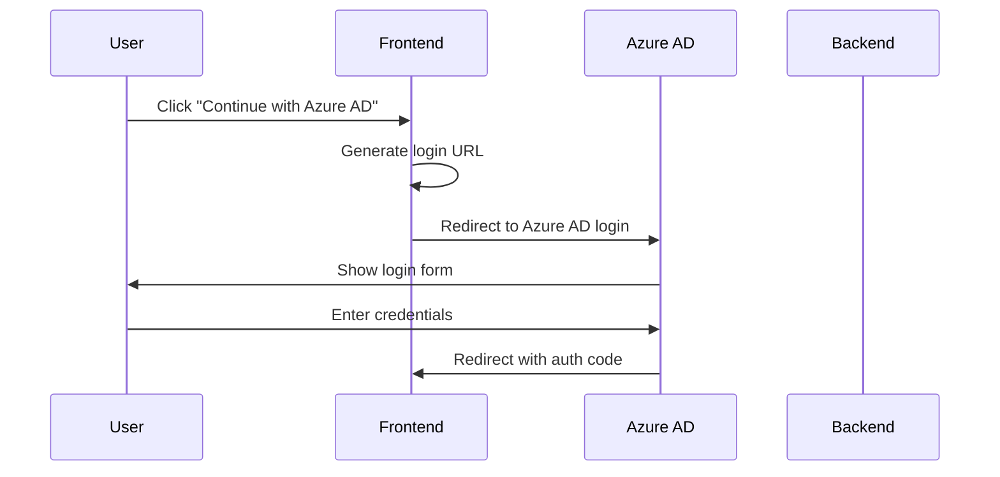
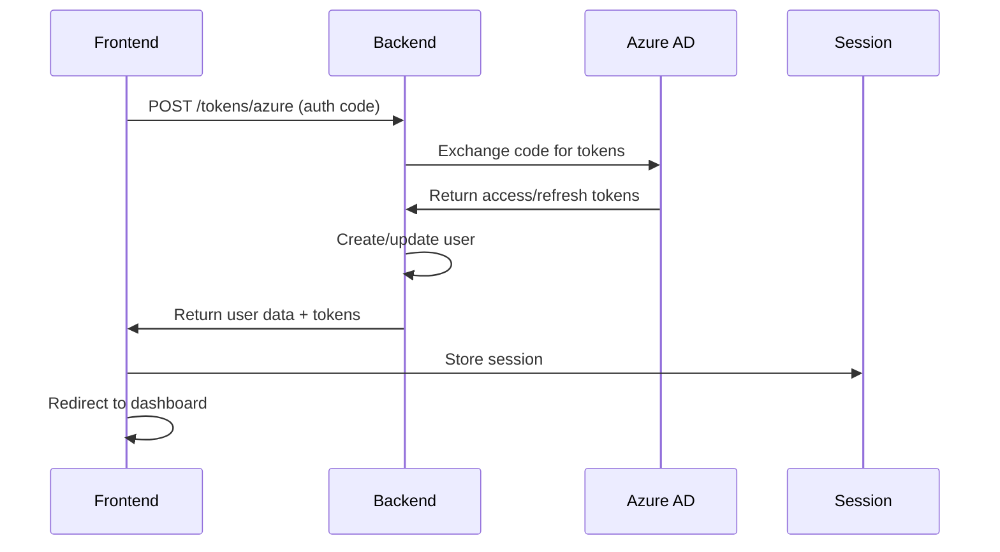

# Azure AD Integration - Complete Frontend Implementation

This document provides a comprehensive overview of the Azure AD integration implementation for the Prowler application frontend.

## 🚀 Overview

The Azure AD integration provides a complete single sign-on (SSO) solution that allows users to authenticate using their Azure Active Directory credentials. The implementation includes:

- **OAuth 2.0/OpenID Connect Authentication Flow**
- **User Management and Synchronization**
- **Configuration Management**
- **Testing and Debugging Tools**
- **Comprehensive Documentation**

## 📁 File Structure

```
ui/
├── actions/auth/
│   ├── azure-ad.ts              # Azure AD authentication actions
│   └── azure-config.ts          # Azure AD configuration actions
├── app/(auth)/azure/
│   ├── page.tsx                 # Configuration page
│   ├── callback/
│   │   └── page.tsx             # OAuth callback handler
│   ├── test/
│   │   └── page.tsx             # Test page
│   └── dashboard/
│       └── page.tsx             # Dashboard page
├── components/auth/
│   ├── azure-ad-login.tsx       # Azure AD login component
│   ├── azure-setup-guide.tsx    # Setup guide component
│   └── azure-status.tsx         # Status component
├── hooks/
│   └── use-azure-ad.ts          # Azure AD hook
├── docs/
│   └── azure-ad-setup.md        # Setup documentation
└── README-AZURE-AD-INTEGRATION.md
```

## 🔧 Core Components

### 1. Authentication Actions (`actions/auth/azure-ad.ts`)

**Key Functions:**
- `getAzureADConfig()` - Retrieve Azure AD configuration from backend
- `exchangeAzureADCode()` - Exchange authorization code for tokens
- `authenticateWithAzureAD()` - Complete authentication flow
- `getAzureADLoginUrl()` - Generate Azure AD login URL
- `testAzureADAuth()` - Test authentication without creating users
- `checkTrialStatus()` - Check user trial status

**Usage:**
```typescript
import { authenticateWithAzureAD, getAzureADConfig } from "@/actions/auth/azure-ad";

// Get configuration
const config = await getAzureADConfig();

// Authenticate user
const result = await authenticateWithAzureAD(authCode);
```

### 2. Azure AD Login Component (`components/auth/azure-ad-login.tsx`)

**Features:**
- Handles Azure AD login initiation
- Error handling and user feedback
- Loading states and disabled states
- Customizable styling and variants

**Usage:**
```tsx
import { AzureADLogin } from "@/components/auth/azure-ad-login";

<AzureADLogin
  variant="bordered"
  size="md"
  disabled={!isAzureOAuthEnabled}
>
  Continue with Azure AD
</AzureADLogin>
```

### 3. Azure AD Hook (`hooks/use-azure-ad.ts`)

**Features:**
- Manages Azure AD configuration state
- Provides loading and error states
- Caches configuration data
- Exposes utility functions

**Usage:**
```tsx
import { useAzureAD } from "@/hooks/use-azure-ad";

const { config, isLoading, error, isConfigured } = useAzureAD();
```

### 4. Status Component (`components/auth/azure-status.tsx`)

**Features:**
- Real-time configuration status
- Visual status indicators
- Quick action buttons
- Configuration details display

## 🔄 Authentication Flow

### 1. User Initiates Login


### 2. Token Exchange and Authentication


## 🛠️ Configuration

### Environment Variables

Azure AD is configured through backend environment variables for secure single-tenant setup. The frontend automatically detects the configuration from the backend.

**Backend (.env):**
```bash
AZURE_AD_ENABLED=True
AZURE_AD_CLIENT_ID=your_client_id
AZURE_AD_CLIENT_SECRET=your_client_secret
AZURE_AD_TENANT_ID=your_tenant_id
AZURE_AD_REDIRECT_URI=http://localhost:3000/azure/callback
AZURE_AD_AUTHORITY=https://login.microsoftonline.com/your_tenant_id
AZURE_AD_SCOPES=openid,profile,email,User.Read
```

### Azure AD App Registration

1. **Register Application** in Azure Portal
2. **Configure Redirect URI**: `http://localhost:3000/azure/callback`
3. **Add API Permissions**:
   - `User.Read`
   - `User.Read.All`
   - `GroupMember.Read.All`
4. **Create Client Secret**
5. **Grant Admin Consent**

## 📱 Pages and Routes

### 1. Configuration Page (`/azure`)
- Form to configure Azure AD settings
- Setup guide integration
- Validation and error handling

### 2. Callback Page (`/azure/callback`)
- Handles OAuth redirect
- Exchanges authorization code
- Creates user session
- Error handling and user feedback

### 3. Test Page (`/azure/test`)
- Test authentication flow
- Check trial status
- Debug configuration issues

### 4. Dashboard Page (`/azure/dashboard`)
- Configuration status
- Quick actions
- Help and documentation links

## 🎨 UI Components

### Azure AD Login Button
- Microsoft Azure branding
- Loading states
- Error handling
- Responsive design

### Status Indicators
- Real-time configuration status
- Color-coded badges
- Action buttons
- Configuration details

### Setup Guide
- Step-by-step instructions
- Interactive navigation
- Code examples
- Troubleshooting tips

## 🔒 Security Features

### 1. Token Security
- Secure token storage
- Automatic token refresh
- Token validation
- Session management

### 2. Error Handling
- Comprehensive error messages
- User-friendly notifications
- Debug information
- Fallback mechanisms

### 3. Configuration Validation
- Environment variable validation
- Azure AD configuration checks
- Redirect URI validation
- Permission verification

## 🧪 Testing

### 1. Unit Tests
- Component testing
- Hook testing
- Action testing
- Utility function testing

### 2. Integration Tests
- Authentication flow testing
- API integration testing
- Error scenario testing
- Configuration testing

### 3. Manual Testing
- OAuth flow testing
- User creation testing
- Error handling testing
- UI/UX testing

## 🚀 Deployment

### Development
1. Set up environment variables
2. Configure Azure AD app registration
3. Start development servers
4. Test authentication flow

### Production
1. Update redirect URIs to production domain
2. Configure SSL certificates
3. Update environment variables
4. Deploy frontend and backend
5. Test production authentication

## 📚 Documentation

### Setup Guide
- Step-by-step configuration
- Azure AD setup instructions
- Environment variable configuration
- Troubleshooting guide

### API Documentation
- Backend API endpoints
- Request/response formats
- Error codes and messages
- Authentication flow details

### User Guide
- How to use Azure AD login
- Configuration management
- Troubleshooting common issues
- Security best practices

## 🔧 Customization

### Styling
- Customizable component themes
- Responsive design
- Dark/light mode support
- Brand integration

### Configuration
- Custom user mapping
- Group synchronization
- Domain restrictions
- Feature flags

### Extensions
- Additional OAuth providers
- Custom authentication flows
- Advanced user management
- Audit logging

## 🐛 Troubleshooting

### Common Issues

1. **"Invalid redirect URI"**
   - Check Azure AD configuration
   - Verify environment variables
   - Ensure exact URI match

2. **"Application not found"**
   - Verify Client ID and Tenant ID
   - Check Azure AD app registration
   - Ensure correct tenant

3. **"Insufficient permissions"**
   - Grant admin consent
   - Verify API permissions
   - Check user roles

4. **"Token exchange failed"**
   - Verify Client Secret
   - Check secret expiration
   - Validate redirect URI

### Debug Steps

1. Check browser console for errors
2. Monitor network requests
3. Review backend logs
4. Verify environment variables
5. Test Azure AD configuration

## 📞 Support

### Resources
- [Azure AD Documentation](https://docs.microsoft.com/en-us/azure/active-directory/develop/)
- [Microsoft Graph API](https://docs.microsoft.com/en-us/graph/)
- [OAuth 2.0 Specification](https://tools.ietf.org/html/rfc6749)
- [OpenID Connect](https://openid.net/connect/)

### Getting Help
1. Review documentation
2. Check troubleshooting guide
3. Review application logs
4. Contact Azure AD administrator
5. Open issue in repository

## 🎯 Next Steps

### Immediate
1. Test complete authentication flow
2. Verify user creation and management
3. Test error scenarios
4. Validate security measures

### Future Enhancements
1. Multi-tenant support
2. Advanced group synchronization
3. Custom claims mapping
4. Audit logging
5. Performance optimization

---

This implementation provides a complete, production-ready Azure AD integration for the Prowler application. The solution is secure, scalable, and maintainable, with comprehensive documentation and testing support.
